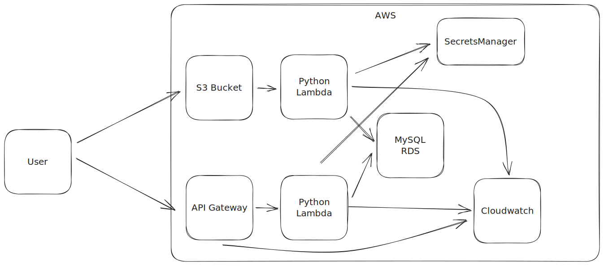

# Ignite assignment

## Architecture



For the first flow of uploading a csv file, i have:

- A S3 Bucket that the user uploads the csv file to
- A Python lambda function that gets invoke once a file is uploaded to the S3 bucket:
  - The function reads the newly created object in S3
  - Parses and validates the content
  - Retrieves the RDS credentials from the SecretsManager
  - Inserts the values into the MySQL RDS instance
- A MySQL RDS instance that stores the data

For the second flow of querying the data, i have:

- An API Gateway that exposes a /data GET endpoint
- A Python lambda function that gets invoked by the API Gateway:
  - Parse the provided query parameters
  - Retrieves the RDS credentials from the SecretsManager
  - Queries RDS instance and returns the results
- A MySQL RDS instance that stores the data

Additionally, the Lambda functions and the API Gateway logs to Cloudwatch

## Implementation

As part of IaC, I have set up the infrastructure using Terraform

## Running

To run the project, you need to:

- Install terraform
- Install awscli and configure your credentials
- Create a SecretsManager on aws called `acme_secrets`
  - Add key-value secrets for the following:
    - mysql_user
    - mysql_password

To spawn AWS infrastructure, run:

```bash
make terra_apply
```

Since the RDS instance will spawn without a schema, run the following script to set it up:

```bash
make setup_mysql
```

## Testing

Both Python Lambda functions currently have unit testing.

To run the tests, run the following:

```bash
make test_lambda
```

## TODO

- Move terraform state to S3
- Add more documentation
- Add alerts on CloudWatch
- Add CIT testing
